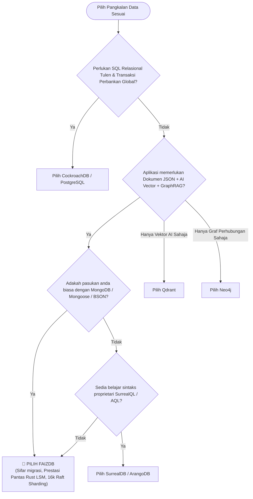

# FaizDB: Analisis Pasaran & Matriks Kompetitif (Competitive Analysis)

Dokumen ini memperincikan kedudukan strategik, perbandingan arkitektur, kekuatan, serta kelemahan **FaizDB** berbanding pesaing-pesaing utama dalam industri pangkalan data moden: Multi-Model, AI/Vector/Graph Khusus, Distributed NewSQL, dan Gergasi Tradisional NoSQL/RDBMS.

---

## 📑 Isi Kandungan

1. [Ringkasan Eksekutif & Moat Arkitektur](#1-ringkasan-eksekutif--moat-arkitektur)
2. [Matriks Perbandingan Global](#2-matriks-perbandingan-global)
3. [Analisis Kategori 1: Pesaing Langsung Multi-Model](#3-analisis-kategori-1-pesaing-langsung-multi-model)
   - SurrealDB
   - FerretDB
   - ArangoDB
4. [Analisis Kategori 2: Pesaing Khusus AI, Vektor & Graf](#4-analisis-kategori-2-pesaing-khusus-ai-vektor--graf)
   - Qdrant
   - Neo4j & Memgraph
5. [Analisis Kategori 3: Pesaing Distributed NewSQL](#5-analisis-kategori-3-pesaing-distributed-newsql)
   - CockroachDB
6. [Analisis Kategori 4: Gergasi Tradisional](#6-analisis-kategori-4-gergasi-tradisional)
   - MongoDB (Atlas)
   - PostgreSQL (pgvector + Apache AGE)
7. [Panduan Pemilihan Senario (When to choose FaizDB)](#7-panduan-pemilihan-senario)

---

## 1. Ringkasan Eksekutif & Moat Arkitektur

Kebanyakan pangkalan data moden berdepan masalah **"Architecture Sprawl"**—di mana sesebuah syarikat terpaksa menguruskan 3 hingga 5 pangkalan data berbeza (contoh: MongoDB untuk profil pengguna, Qdrant untuk AI embedding, Neo4j untuk graf hubungan, dan Redis untuk caching).

**FaizDB menghapuskan bebanan ini melalui 4 Moat Teras:**
1. **Drop-in MongoDB Wire Protocol (Port 27017):** Sifar geseran migrasi (Zero-Friction Migration). Pembangun boleh terus menggunakan SDK rasmi MongoDB (`mongoose`, `pymongo`, `mongodb-driver`) tanpa mengubah kod aplikasi sedia ada.
2. **Enjin Storan Natif Safe Rust (LSM-Tree + Zero-Copy Byte Slices):** Memori efisien, tiada Garbage Collection (GC) pauses, dan *footprint* yang sangat ringan (<50MB idle).
3. **Unified Multi-Model (Document + Graph + Vector HNSW + Full-Text):** Melakukan carian vektor AI serentak dengan *Graph Traversal* dan *Document ACID* dalam satu query tanpa perlu Two-Phase Commit merentas rangkaian.
4. **Auto-Sharding Teragih (16,384 Raft Virtual Slots):** Pembahagian data dan skala mendatar berautonomi tinggi tanpa konfigurasi rumit.

---

## 2. Matriks Perbandingan Global

| Dimensi Penilaian | **FaizDB** 🚀 | **SurrealDB** | **FerretDB** | **ArangoDB** | **Qdrant** | **CockroachDB** | **Neo4j** | **MongoDB (Atlas)** | **PostgreSQL (+Extensions)** |
| :--- | :---: | :---: | :---: | :---: | :---: | :---: | :---: | :---: | :---: |
| **Bahasa Teras** | **Safe Rust** | Rust | Go | C++ | Rust | Go | Java | C++ | C |
| **Protokol Wire** | **Mongo 27017** + REST/WS | SurrealQL | Mongo 27017 | AQL / HTTP | REST / gRPC | Postgres 26257 | Bolt / Cypher | Mongo Wire | Postgres 5432 |
| **Storan Enjin** | **LSM-Tree (Zero-Copy)** | KV Engine / RocksDB | Postgres/SQLite Luaran | RocksDB | Custom Vector Store | Pebble (LSM in Go) | Native Graph Store | WiredTiger | Heap MVCC |
| **Multi-Model** | ✅ Terpadu (Semua) | ✅ Terpadu | ❌ Dokumen Sahaja | ✅ Doc + Graph | ❌ Vektor Sahaja | ❌ Relasional SQL | ❌ Graf Sahaja | ⚠️ Dokumen (Cloud Vektor) | ⚠️ Bergantung Extension |
| **AI / Vector HNSW** | ✅ Natif Terbina | ✅ Terbina | ❌ Tiada | ⚠️ Plugin | ✅ Sangat Pantas | ❌ Tiada | ⚠️ Terhad | ⚠️ Atlas Sahaja | ⚠️ pgvector (Table Bloat) |
| **Knowledge Graph (GraphRAG)** | ✅ Natif Terbina | ⚠️ Graph Asas | ❌ Tiada | ✅ AQL Graph | ❌ Tiada | ❌ Tiada | ✅ Peneraju Graf | ❌ Tiada | ⚠️ Apache AGE (Kompleks) |
| **Clustering / Sharding** | ✅ **16,384 Raft Slots** | ⚠️ TiKV Dependency | ❌ Bergantung DB Luaran | ✅ Sharding | ✅ Raft Sharding | ✅ Multi-Raft Dynamic Ranges | ⚠️ Causal Clustering | ✅ Sharded Clusters | ❌ Citus / Manual |
| **GC Pause & Memory Bloat** | ✅ **Sifar (Zero GC)** | ✅ Rendah | ❌ GC Overhead (Go) | ⚠️ Tinggi (C++) | ✅ Rendah | ❌ GC Overhead (Go) | ❌ Berat (JVM GC) | ⚠️ Cache Overhead | ⚠️ Table/Index Bloat |
| **Model Lesen** | **Open / Self-Host** | BSL / FSL | Apache 2.0 | Apache / Enterprise | Apache 2.0 | BSL (Komersial) | GPL / Enterprise | SSPL (Proprietari) | PostgreSQL License |

---

## 3. Analisis Kategori 1: Pesaing Langsung Multi-Model

### 3.1 SurrealDB
* **Asas Teknologi:** 100% Rust, multi-model (Document, Graph, Vector, Full-Text, Time-Series), sokongan WebSocket/Live Queries.
* **Kekuatan:** Ekosistem moden, sokongan schema-full & schema-less, sokongan distributed backend (TiKV, FoundationDB).
* **Di Mana FaizDB Mengatasinya:**
  - **Kurva Pembelajaran & Migrasi:** SurrealDB menggunakan bahasa pertanyaannya sendiri (*SurrealQL*) yang memaksa pembangun menulis semula lapisan ORM dan logik pangkalan data. FaizDB menyediakan **Drop-in MongoDB Wire Protocol (Port 27017)**—anda boleh terus *pointing* aplikasi Node.js/Python/Go sedia ada tanpa tukar pustaka.
  - **Seni Bina Ringan & Bersepadu:** FaizDB mempunyai enjin storan LSM-Tree terbina secara natif tanpa memerlukan runtime backend luaran yang kompleks.

### 3.2 FerretDB
* **Asas Teknologi:** Enjin sumber terbuka berasaskan Go yang bertindak sebagai lapisan penterjemah (proxy layer) protokol MongoDB di atas PostgreSQL atau SQLite.
* **Kekuatan:** Membolehkan penggunaan arahan MongoDB di atas pangkalan data relasional PostgreSQL.
* **Di Mana FaizDB Mengatasinya:**
  - **Prestasi & Latensi:** FerretDB hanyalah lapisan proksi penterjemah (translation layer) yang menukar BSON ke SQL secara dinamik, menyebabkan *performance penalty* yang ketara dan overhead memori (Go GC).
  - **Keupayaan AI & Graf:** FerretDB langsung tidak menyokong carian vektor HNSW mahupun traversal graf natif. FaizDB ialah storan natif Rust LSM-Tree dengan sokongan AI GraphRAG terbina.

### 3.3 ArangoDB
* **Asas Teknologi:** Perintis pangkalan data multi-model gred enterprise (Document + Graph + ArangoSearch) dalam C++.
* **Kekuatan:** Keupayaan graph traversal yang matang dan pengoptimuman carian teks enterprise (ArangoSearch).
* **Di Mana FaizDB Mengatasinya:**
  - **Penggunaan Memori:** ArangoDB ditulis dalam C++ dengan model memori yang agak berat (*heavy footprint*). FaizDB menggunakan *Zero-Copy Byte Slices* dalam Safe Rust yang memberikan penggunaan RAM jauh lebih rendah.
  - **Sintaks Pertanyaan:** ArangoDB memerlukan bahasa AQL (*ArangoDB Query Language*), manakala FaizDB menyokong ekosistem pertanyaan BSON/MongoDB yang lebih meluas.

---

## 4. Analisis Kategori 2: Pesaing Khusus AI, Vektor & Graf

### 4.1 Qdrant
* **Asas Teknologi:** Pangkalan data vektor berasaskan Rust khusus untuk carian persamaan HNSW dan *payload filtering*.
* **Kekuatan:** Prestasi carian vektor berkualiti tinggi, pengoptimuman SIMD/AVX, dan sokongan skala vektor teragih.
* **Di Mana FaizDB Mengatasinya:**
  - **Kekurangan Multi-Document & ACID:** Qdrant hanya menyokong vektor dan metadata dokumen ringkas (*flat payloads*). Ia tiada enjin transaksi multi-dokumen ACID, tiada operasi kemas kini dokumen kompleks, dan tiada penjelajahan nod graf (GraphRAG).
  - **Penyatuan Stack AI:** Bersama FaizDB, anda tidak memerlukan pangkalan data berasingan untuk menyimpan data perniagaan dan embedding vektor.

### 4.2 Neo4j & Memgraph
* **Asas Teknologi:** Neo4j (Java) dan Memgraph (C++) adalah peneraju pangkalan data graf berasaskan model *Property Graph* dan bahasa pertanyaan Cypher.
* **Kekuatan:** Algoritma graf mendalam (PageRank, Shortest Path, Centrality) dan komuniti graf yang besar.
* **Di Mana FaizDB Mengatasinya:**
  - **Overhead JVM & Garbage Collection (Neo4j):** Neo4j berasaskan Java sering mengalami *stop-the-world GC pauses* apabila memegang jutaan nod dalam memori.
  - **Ketiadaan Paduan Dokumen & Vektor Asli:** Neo4j menambah sokongan vektor sebagai indeks tambahan, manakala FaizDB mereka bentuk hubungan graf, dokumen JSON, dan vektor HNSW secara bersepadu dalam struktur *Index Key-Value LSM* yang seragam.

---

## 5. Analisis Kategori 3: Pesaing Distributed NewSQL

### 5.1 CockroachDB

#### 🔍 Asas Teknologi:
Diilhamkan oleh Google Spanner, CockroachDB dibina menggunakan Go (dengan enjin storan Pebble LSM-Tree). Ia menyediakan konsistensi ACID tahap tertinggi (*Serializable Isolation*) merentas pelbagai rantau menggunakan *Multi-Raft consensus* dan *Hybrid Logical Clocks (HLC)*, serasi dengan protokol PostgreSQL (Port 26257).

#### 🛡️ Kekuatan CockroachDB:
1. **Ketahanan Melampau (Extreme High Availability):** Mampu bertahan daripada kegagalan nod atau pusat data tanpa sebarang *downtime* (Zero-Downtime Multi-Region Failover).
2. **ACID Relasional Global:** Transaksi teragih (*distributed transactions*) yang tepat dan konsisten untuk data kewangan/perbankan.
3. **Penskalaan Mendatar Automatik (Auto-Rebalancing):** Data dipecahkan secara automatik kepada julat 64MB (*Ranges*) dan diimbangi merentasi kluster.

#### ⚠️ Kelemahan CockroachDB & Di Mana FaizDB Mengatasinya:
1. **Beban Memori & CPU yang Sangat Berat:** CockroachDB terkenal dengan penggunaan RAM yang tinggi (biasanya memerlukan minimum 2GB-4GB RAM untuk satu nod asas) dan *Garbage Collection overhead* dalam Go. FaizDB menggunakan Safe Rust dengan memori *Zero-Copy Byte Slices*, menjimatkan kos infrastruktur dan beroperasi pada spesifikasi serendah peranti IoT/Edge.
2. **Ketiadaan Keupayaan AI & GraphRAG:** CockroachDB hanyalah pangkalan data relasional SQL berjadual. Ia tidak mempunyai indeks carian vektor HNSW natif mahupun *Graph Traversal Engine* untuk aplikasi AI moden.
3. **Latensi Transaksi Teragih yang Tinggi:** Kerana memerlukan konsensus Raft dan *distributed locking* merentas nod untuk setiap operasi SQL, *write latency* (p99) CockroachDB jauh lebih perlahan berbanding storan LSM-Tree FaizDB yang dioptimumkan untuk *high-throughput append-only writes*.
4. **Sekatan Lesen Komersial (BSL):** CockroachDB telah menukar model perlesenan kepada BSL/Enterprise yang menyekat penggunaan bebas untuk sesetengah perkhidmatan awan. FaizDB menawarkan fleksibiliti penggunaan kendiri (*self-hosted binary*) yang telus.
5. **Tiada Sokongan Ekosistem MongoDB:** CockroachDB mematuhi protokol SQL Postgres. Bagi pembangun yang membina aplikasi bersandarkan dokumen NoSQL / JSON, penukaran ke CockroachDB memerlukan perubahan radikal pada skema data dan kod aplikasi.

---

## 6. Analisis Kategori 4: Gergasi Tradisional

### 6.1 MongoDB (Atlas)
* **Kekuatan:** Piawaian de-facto untuk pangkalan data dokumen NoSQL dunia dengan ekosistem driver/ORM paling meluas.
* **Kelemahan & Kelebihan FaizDB:**
  - **Vendor Lock-in Cloud:** Ciri carian vektor dan carian teks penuh MongoDB (Atlas Search/Vector) terikat kepada perkhidmatan awan berbayar (Atlas), tidak boleh dihoskan sendiri dengan mudah dalam satu binari tunggal.
  - **Enjin C++ WiredTiger:** Memerlukan konfigurasi *memory pool* yang besar. FaizDB menawarkan binari Safe Rust yang serasi 100% dengan protokol MongoDB tetapi boleh dihoskan di mana-mana pelayan persendirian.

### 6.2 PostgreSQL (bersama pgvector + Apache AGE)
* **Kekuatan:** Pangkalan data relasional paling stabil, dipercayai, dan disokong oleh ekosistem plugin yang amat luas.
* **Kelemahan & Kelebihan FaizDB:**
  - **Kerumitan Extension Sprawl:** Menggabungkan `pgvector` untuk vektor dan `Apache AGE` untuk graf menyebabkan isu *table bloat*, masalah *VACUUM contention*, konfigurasi memori indeks yang rumit, dan degradasi prestasi apabila data membesar.
  - **Ketiadaan Auto-Sharding Natif:** PostgreSQL memerlukan perisian tambahan (seperti Citus) atau partisyen manual untuk skala mendatar, berbeza dengan FaizDB yang mempunyai 16,384 slot Raft secara automatik.

---

## 7. Panduan Pemilihan Senario

### Kesimpulan Ringkas:
* **Pilih CockroachDB** sekiranya anda membina sistem teras perbankan (*Core Banking*) yang memerlukan jadual relasional SQL tegar merentasi pelbagai benua.
* **Pilih FaizDB** sekiranya anda membina aplikasi moden, perkhidmatan mikro (*microservices*), sistem berasaskan AI / LLM / GraphRAG, atau aplikasi NoSQL berprestasi tinggi yang memerlukan integrasi pantas tanpa kerumitan pengurusan pelbagai pangkalan data.
