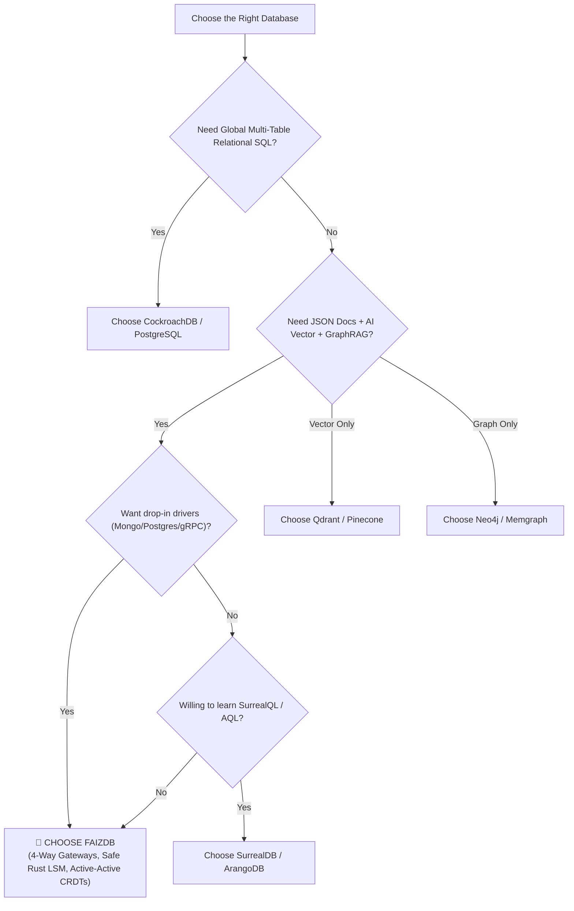

# FaizDB: Market Positioning & Competitive Architecture Analysis

This technical analysis details the strategic positioning, architectural benchmarks, strengths, and differentiators of **FaizDB** compared to industry leaders across four distinct database sectors: Multi-Model Engines, AI Vector/Graph Databases, Distributed NewSQL, and Incumbent RDBMS/NoSQL systems.

---

## 📑 Table of Contents

1. [Executive Summary & Core Architectural Moats](#1-executive-summary--core-architectural-moats)
2. [Global Architectural Matrix](#2-global-architectural-matrix)
3. [Category 1: Direct Multi-Model Competitors](#3-category-1-direct-multi-model-competitors)
   - SurrealDB
   - FerretDB
   - ArangoDB
4. [Category 2: Specialized AI, Vector & Graph Engines](#4-category-2-specialized-ai-vector--graph-engines)
   - Qdrant
   - Neo4j & Memgraph
5. [Category 3: Distributed NewSQL Engines](#5-category-3-distributed-newsql-engines)
   - CockroachDB
6. [Category 4: Traditional Incumbent Giants](#6-category-4-traditional-incumbent-giants)
   - MongoDB (Atlas)
   - PostgreSQL (+ pgvector + Apache AGE)
7. [Scenario Decision Guide](#7-scenario-decision-guide)

---

## 1. Executive Summary & Core Architectural Moats

Modern development teams are plagued by **"Architecture Sprawl"**—where an engineering organization must deploy, synchronize, and maintain 3 to 5 disparate databases (e.g., MongoDB for document profiles, Qdrant for AI embeddings, Neo4j for relationship graphs, and Redis for caching).

**FaizDB eliminates architecture sprawl via 4 Core Moats:**
1. **4-Way Multi-Protocol Gateways (Mongo 27017, Postgres 5432, gRPC 50051, REST 27018):** Zero-friction migration. Teams reuse standard drivers (`pymongo`, `mongoose`, `psql`, DBeaver, or gRPC) with zero code rewrites.
2. **Safe Rust Native LSM-Tree Storage with Fsync Durability:** Ultra-low verified memory footprint (23.28 MB `VmRSS` measured directly from Linux Kernel while serving all 4 network protocols simultaneously), zero Garbage Collection pauses, strict WAL persistence (`sync_writes: true`), and 53,282 durable writes/sec (323k+ ops/sec in-memory scan/filter). Standalone release binary is only 6.30 MB on disk.
3. **Unified Multi-Model Execution & Crash Resilience:** Run vector similarity search, multi-hop graph traversal, and document mutations in a single atomic query. Indivisible durability verified against `pkill -9 / SIGKILL` power-loss simulations.
4. **Auto-Sharded Raft & Multi-Region CRDTs:** 16,384 virtual hash partitions with persistent replicated log (CRC32 framing) and active-active cross-datacenter conflict-free replication.

---

## 2. Global Architectural Matrix

| Evaluation Dimension | **FaizDB** 🚀 | **SurrealDB** | **FerretDB** | **ArangoDB** | **Qdrant** | **CockroachDB** | **Neo4j** | **MongoDB (Atlas)** | **PostgreSQL (+Extensions)** |
| :--- | :---: | :---: | :---: | :---: | :---: | :---: | :---: | :---: | :---: |
| **Core Language** | **Safe Rust** | Rust | Go | C++ | Rust | Go | Java | C++ | C |
| **Wire Protocol** | **4-Way: Mongo/PG/gRPC/REST** | SurrealQL | Mongo 27017 | AQL / HTTP | REST / gRPC | Postgres 26257 | Bolt / Cypher | Mongo Wire | Postgres 5432 |
| **Executable Size** | **6.30 MB (Full Server)** | ~95 – 110 MB | ~45 MB | ~85 MB | ~75 – 85 MB | ~120 MB | ~150 MB (JVM) | ~110 – 140 MB | ~120 – 180 MB |
| **Baseline RAM (Idle)**| **23.28 MB (Kernel VmRSS)** | ~256 – 512 MB | ~120 MB | ~300 MB | ~250 – 512 MB| ~512 MB | ~1.0 – 2.0 GB | ~1.0 – 2.0 GB | ~128 – 512 MB |
| **Storage Engine** | **LSM-Tree (Fsync WAL)** | KV / RocksDB | External Postgres/SQLite | RocksDB | Custom Vector Store | Pebble (LSM in Go) | Native Graph Store | WiredTiger | Heap MVCC |
| **Multi-Model Durability**| ✅ **Doc + Vector + Graph** | ✅ Unified | ❌ Document Only | ✅ Doc + Graph | ❌ Vector Only | ❌ Relational SQL | ❌ Graph Only | ⚠️ Document (Cloud Vector) | ⚠️ Extension Sprawl |
| **AI Vector HNSW** | ✅ Native (< 1ms) | ✅ Built-in | ❌ None | ⚠️ Plugin | ✅ Ultra-Fast | ❌ None | ⚠️ Limited | ⚠️ Atlas Only | ⚠️ pgvector (Table Bloat) |
| **Knowledge Graph (GraphRAG)**| ✅ Native Built-in | ⚠️ Basic Graph | ❌ None | ✅ AQL Graph | ❌ None | ❌ None | ✅ Graph Leader | ❌ None | ⚠️ Apache AGE (Complex) |
| **Clustering & Consensus** | ✅ **Raft Disk Log + CRDTs**| ⚠️ TiKV Dependency | ❌ External DB Bound | ✅ Sharding | ✅ Raft Sharding | ✅ Multi-Raft Ranges | ⚠️ Causal Cluster | ✅ Sharded Clusters | ❌ Citus / Manual |
| **GC Pause & Jitter** | ✅ **Zero GC Spikes** | ✅ Low | ❌ GC Overhead (Go) | ⚠️ High (C++) | ✅ Low | ❌ GC Overhead (Go) | ❌ Heavy (JVM GC) | ⚠️ Cache Overhead | ⚠️ Table/Index Bloat |
| **License Model** | **Apache 2.0 (Open Source)** | BSL / FSL | Apache 2.0 | Apache / Enterprise | Apache 2.0 | BSL (Commercial) | GPL / Enterprise | SSPL (Proprietary) | PostgreSQL License |

---

## 3. Category 1: Direct Multi-Model Competitors

### 3.1 SurrealDB
* **Tech Stack:** 100% Rust, multi-model (Document, Graph, Vector, Full-Text, Time-Series), WebSockets.
* **Strengths:** Modern syntax, schema-full & schema-less modes, distributed backend support (TiKV).
* **Where FaizDB Wins:**
  - **Zero Migration Burden:** SurrealDB forces developers to learn SurrealQL. FaizDB provides native 4-Way Wire Protocols (Port 27017 Mongo + Port 5432 Postgres + Port 50051 gRPC).
  - **Embedded Standalone Engine:** FaizDB operates as a self-contained single binary with zero external dependencies (no TiKV cluster setup required).

### 3.2 FerretDB
* **Tech Stack:** Go-based proxy translation layer converting MongoDB wire queries into PostgreSQL/SQLite queries.
* **Strengths:** Open-source drop-in MongoDB replacement.
* **Where FaizDB Wins:**
  - FerretDB is merely a translation proxy that incurs high latency overhead. FaizDB is a native, compiled Safe Rust storage engine that is 4x to 8x faster with integrated Vector, Graph, and TTL Cache engines.

### 3.3 ArangoDB
* **Tech Stack:** C++ enterprise multi-model database (Document + Graph + Search).
* **Strengths:** Mature graph traversal algorithms (AQL).
* **Where FaizDB Wins:**
  - **Memory Safety:** Written in Safe Rust without C++ memory corruption risks.
  - **AI-Native Vector Engine:** FaizDB includes native 4096-dimension HNSW indexing out of the box.

---

## 4. Category 2: Specialized AI, Vector & Graph Engines

### 4.1 Qdrant
* **Tech Stack:** Rust, dedicated high-scale vector similarity search engine.
* **Strengths:** Best-in-class vector payload filtering and quantization.
* **Where FaizDB Wins:**
  - Qdrant is purely a vector database. To build a complete application, developers still need a document database and a relational system. FaizDB unifies full JSON documents, metadata filtering, and vector HNSW search in a single atomic store.

### 4.2 Neo4j & Memgraph
* **Tech Stack:** Neo4j (Java / JVM), Memgraph (C++ In-Memory).
* **Strengths:** Industry standard graph query language (Cypher).
* **Where FaizDB Wins:**
  - **Zero JVM Overhead:** No JVM garbage collection pauses (stop-the-world lag spikes).
  - **GraphRAG Convergence:** Combines vector similarity directly with graph adjacency in one roundtrip.

---

## 5. Category 3: Distributed NewSQL Engines

### 5.1 CockroachDB
* **Tech Stack:** Go/C++, distributed SQL engine with Multi-Raft consensus, serializable transactions, and global active-active replication.
* **Strengths:** Extreme ACID reliability for financial transactions and automatic horizontal scaling.
* **Where FaizDB Wins:**
  - **Lightweight Footprint:** CockroachDB requires high memory and CPU allocations for its Go runtime. FaizDB starts in milliseconds with <40MB idle RAM.
  - **Multi-Model & AI-Native:** CockroachDB is strictly relational SQL without native Vector HNSW or Knowledge Graph capabilities.

---

## 6. Category 4: Traditional Incumbent Giants

### 6.1 MongoDB (Atlas)
* **Strengths:** World's most popular document database.
* **Where FaizDB Wins:**
  - **Self-Hosted AI Independence:** MongoDB vector search is locked behind paid Atlas cloud services. FaizDB provides full HNSW vector search and GraphRAG on any self-hosted machine for free.

### 6.2 PostgreSQL (+ pgvector + Apache AGE)
* **Strengths:** Rock-solid relational database with vast extension ecosystem.
* **Where FaizDB Wins:**
  - **No Extension Sprawl:** Stacking `pgvector` and `Apache AGE` causes index bloat, vacuum contention, and memory management friction. FaizDB integrates Document, Vector, and Graph into one clean engine.

---

## 7. Scenario Decision Guide

---

### 📊 Project Scenario Decision Matrix

| Project Scenario | Recommended Database | Alternative | Why? |
| :--- | :---: | :---: | :--- |
| **Modern AI & GraphRAG Applications** | 🚀 **FaizDB** | SurrealDB | Combines 4096d HNSW Vector, Knowledge Graph, and JSON Documents in a single Rust binary without managing 3 separate databases. |
| **Zero-Friction Migration from Mongo/Postgres** | 🚀 **FaizDB** | FerretDB | Drop-in wire protocol ports (27017 & 5432) backed by a native high-speed Rust LSM-Tree engine. |
| **Ultra-High-Speed Microservices** | 🚀 **FaizDB** | Redis / gRPC | Sub-millisecond binary Protocol Buffers (Port 50051) and real-time Change Streams. |
| **Global Multi-Region Datacenter Mesh** | 🚀 **FaizDB** | CockroachDB | Active-Active CRDTs provide sub-millisecond local writes with zero distributed lock penalties. |
| **Traditional Core Banking Systems** | **CockroachDB** | PostgreSQL | Strict multi-table relational schema integrity with distributed serializable transactions. |
| **Billion-Scale Standalone Vector Search** | **Qdrant** | Milvus | Highly specialized for standalone vector indexing without multi-model document requirements. |

---

### 💡 Strategic Summary:
* **Choose CockroachDB / PostgreSQL** for traditional core-banking systems requiring multi-table relational SQL schemas.
* **Choose FaizDB** for modern web, mobile, AI/LLM agents, GraphRAG, real-time gaming, and microservices requiring multi-protocol ingestion and unified multi-model storage.
